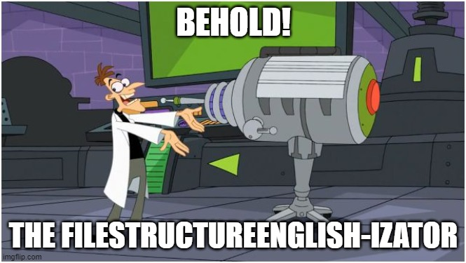

# File Structure Englishizator

Behold! I present you my brand new File Structure Englishizator!



It's a Python program created to transform your file structure to an english keyboard friendly one. It will also help you get rid of spaces in your file or directory names - it can change them to underscores. It can be configured to ignore some names, to do a recursive transform or to not change spaces to underscores. By default, the program makes a backup before changing any of your file or directory names.

## Usage

Clone this repo and put all the files in the root directory of your file structure, eg. your documents directory. Install the unidecode dependency: `pip install unidecode`.
Run the file_structure_englishizator.py file (`python file_structure_englishizator.py`) or check the configuration first.

## Configuration

The program can be configured in the config.json file.

### Configuration options

+ **ignored_names**: An array of strings that should not be part of name of any renamed file or directory. For example: `"ignored_names": ["Folder with spaces and áccénts"]`
+ **files**: Boolean. Rename files or not. Example: `"files": false`
+ **directories**: Boolean. Rename folders or not. Example: `"directiories: true"`
+ **recursive**: Boolean. Rename recursively - walk down the directory tree and change names in all subdirectories. Example: `"recursive": true`
+ **backup**: Boolean. Generate backup or not. Example: `"backup": true`
+ **backup_name**: String. The name of the backup zip archive. Example: `"backup_name": "new_backup"`
+ **replace_spaces**: Boolean. Replace spaces with underscores or not. Example: `"replace_spaces": false`
+ **confirm_required**: Boolean. Require user confirmation or not. Example: `"confirm_required": true`

### Default configuration

```json
{
    "ignored_names": [],
    "files": true,
    "directories": true,
    "recursive": false,
    "backup": true,
    "backup_name": "backup",
    "replace_spaces": true,
    "confirm_required": true
}
```

## License

This program is available under the MIT license.

Copyright &copy; 2022 Pavel40

Permission is hereby granted, free of charge, to any person obtaining a copy of this software and associated documentation files (the "Software"), to deal in the Software without restriction, including without limitation the rights to use, copy, modify, merge, publish, distribute, sublicense, and/or sell copies of the Software, and to permit persons to whom the Software is furnished to do so, subject to the following conditions:

The above copyright notice and this permission notice shall be included in all copies or substantial portions of the Software.

THE SOFTWARE IS PROVIDED "AS IS", WITHOUT WARRANTY OF ANY KIND, EXPRESS OR IMPLIED, INCLUDING BUT NOT LIMITED TO THE WARRANTIES OF MERCHANTABILITY, FITNESS FOR A PARTICULAR PURPOSE AND NONINFRINGEMENT. IN NO EVENT SHALL THE AUTHORS OR COPYRIGHT HOLDERS BE LIABLE FOR ANY CLAIM, DAMAGES OR OTHER LIABILITY, WHETHER IN AN ACTION OF CONTRACT, TORT OR OTHERWISE, ARISING FROM, OUT OF OR IN CONNECTION WITH THE SOFTWARE OR THE USE OR OTHER DEALINGS IN THE SOFTWARE.
